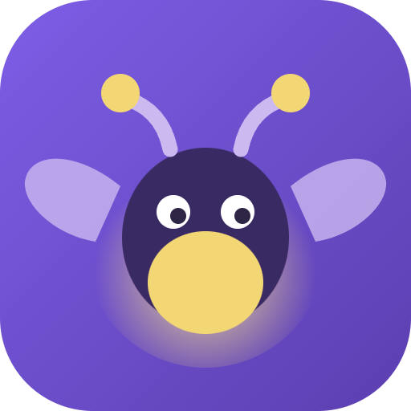

<p align="center">
  
</p>

<h1 align="center">PyCampus</h1>

<p align="center">
  Aprenda Python em português, com Python de verdade rodando no navegador.<br>
  <strong><a href="https://jaoabyo.github.io/pycampus/">Abrir o campus</a></strong>
</p>

---

Abre no celular e no computador, sem instalar nada. Dá para **adicionar à tela de início** e usar como aplicativo, inclusive sem internet depois do primeiro acesso.

O que muda no site publicado, em relação ao PyCampus aberto no seu computador:

- **O Lumi conversa também aqui**, com o computador ligado: dê um duplo clique em `iniciar-lumi-online.cmd`, copie o endereço que aparecer e cole em *Configurações → Onde a IA do Lumi mora*. Sem isso, as dicas escritas dos quatro degraus continuam funcionando em qualquer aparelho, sem depender de nada.
- **As respostas de `input()` precisam ser preenchidas antes de executar**, no campo "Entradas para input()". Responder durante a execução exige cabeçalhos que o GitHub Pages não envia. No computador funciona dos dois jeitos.
- **O progresso acompanha você entre aparelhos** se ligar a nuvem em *Configurações*: ele passa a ser guardado num Gist privado da sua conta do GitHub. Sem isso, fica só no navegador daquele aparelho, e a exportação de backup continua disponível.

Atualização dos projetos: os oito projetos agora abrem no estúdio, com 42 passos de tarefa, dicas graduais, conferência e explicação escrita pelo estudante. Os programas resolvidos da calculadora são apenas fixtures de teste; não são entregues pelo estúdio. Código, posição, respostas e rascunhos de README sobrevivem ao recarregamento e ao backup. As respostas dos projetos também entram no relatório de aprendizagem.

Cada projeto inclui um roteiro para escrever README com palavras próprias, baixar código e documentação, testar no computador e publicar pelo navegador do GitHub. A maior parte da prática Python roda no navegador; duas etapas de servidor da API rodam no computador e uma etapa do projeto final é planejamento, explicitamente identificadas. A conferência de projetos abertos e de explicações é autoavaliação, não correção automática de domínio. Nenhum repositório é criado ou publicado automaticamente.

O editor agora pergunta durante a execução de `input("Sua pergunta: ")`. Deixe Entradas vazio para responder na tela; se preencher linhas antes, elas serão consumidas automaticamente. A calculadora tem sete passos com exemplos comentados, desfazer troca de código e guia de publicação pelo navegador do GitHub. Os demais projetos possuem roteiros com ações e verificações manuais; a oficina filtra atividades pelas aulas já concluídas.

Para hospedagem, o input interativo exige HTTPS (ou localhost) e os cabeçalhos `Cross-Origin-Opener-Policy: same-origin` e `Cross-Origin-Embedder-Policy: require-corp`, que permitem compartilhar o buffer de resposta entre página e worker. Vite dev/preview já os envia; `public/_headers` atende provedores que reconhecem esse formato. Em outros provedores, configure os mesmos cabeçalhos. As perguntas interativas aparecem separadas da saída do programa. Recarregue a página após a atualização. Nenhuma publicação é feita automaticamente.

Verificação do fluxo guiado: inicie Vite na porta 5176 e execute `node scripts/check-guided-projects.mjs`. Usa Edge headless com perfil temporário, separado da sessão do estudante.

Para repetir a verificação dos exemplos e da interface, inicie uma instância isolada com `npm run dev -- --port 5176 --strictPort` e execute `npm run test:curriculum` em outro terminal. Requer Microsoft Edge instalado e internet para carregar Pyodide. O teste usa um perfil temporário e não altera o progresso do navegador pessoal. `PYCAMPUS_TEST_URL` permite configurar outra origem de teste.

Plataforma pessoal e gamificada para aprender Python em português, feita com React e Vite. Formação independente para complementar a faculdade, com introdução a temas avançados e projetos para aprofundamento.

## Ambiente e limites

- **Python 3.12.7** (CPython compilado para o navegador via Pyodide) e **SQLite 3.39.0**.
- Biblioteca padrão disponível; **pacotes externos não** — sem `pip install`, `requests`, `pandas` ou `numpy`.
- O código do estudante **não acessa a internet**. Arquivos criados são temporários.
- Cada execução para em 15 segundos, para laço infinito não travar o navegador.
- Material **complementar**: não substitui o roteiro de nenhuma disciplina e não emite certificado.

Encontrou erro de conteúdo? [Abra uma issue](https://github.com/Jaoabyo/pycampus/issues/new) — conteúdo errado é pior que conteúdo ausente. A página **Sobre e limites**, dentro do campus, traz o mesmo resumo e o histórico de melhorias.

## Abrir no computador

Requisitos: Node.js 20.19+ ou 22.12+ e npm. Na pasta do projeto:

```powershell
npm.cmd install
npm.cmd run dev
```

Abra **http://127.0.0.1:5173**. O arquivo `iniciar-pycampus.cmd` também inicia a aplicação com um duplo clique depois da instalação das dependências. O terminal deve ficar aberto enquanto você usa o campus.

## O que está implementado

- Painel com progresso real, XP, níveis, metas diárias e semanais.
- Aviso central quando desafio e revisão estão resolvidos; confirmação explícita para concluir. Celebração com confetes, XP, emblemas e subida de nível. A primeira aula concluída do dia acende um foguinho animado. Clicar no emblema repete a animação sem conceder pontos extras. Compatível com teclado e movimento reduzido.
- 8 etapas e 48 aulas autorais, cada uma com teoria, exemplo executável, exercício e revisão.
- Sequência revisada: objetivo e pré-requisitos, exemplo explicado em passos clicáveis, dicas progressivas e preparação dos projetos. A aula de tipos não cobra contas; a sintaxe das contas é ensinada na aula seguinte. Veja `REVISAO-PEDAGOGICA.md`.
- Laboratório com Python real via Pyodide em um Web Worker, entrada padrão, saída, erros, interrupção e limite de execução.
- Aula de condicionais ajustada ao material da faculdade, com simulador de dois ou três caminhos. Veja `REFERENCIA-FACULDADE.md`.
- Oito propostas de projetos, com escopo, requisitos e link do repositório.
- Estúdio do projeto para a **Calculadora de orçamento**: cinco passos de construção verificados pela saída, no editor da própria plataforma, com o código salvo por projeto. Cada passo traz apenas a instrução e a saída esperada — sem código inicial, sem dicas e sem passo a passo comentado, para verificar se o estudante escreve sozinho. Concluídos os cinco, abre um guia de publicação no GitHub com os oito comandos de Git explicados um a um, o download do `.py` e um campo de link que aceita só endereços `https://github.com/usuario/repositorio`. O botão "Conferir no GitHub" consulta a API pública e confirma que o repositório existe e está acessível; ele não lê nem avalia o código, e precisa de internet. Os outros sete projetos seguem com o roteiro de requisitos por autoavaliação.
- Oficina de prática com 24 miniprojetos curtos, um por assunto das aulas de fundamentos, lógica, estruturas de dados e orientação a objetos. A sequência segue o método PRIMM: **prever** a saída antes de executar, **investigar** o mecanismo (pergunta sobre o código e uma linha para explicar sem consultar), **mudar** uma parte do exemplo e **criar** a própria versão, terminando com uma explicação escrita.
- Revisão espaçada com intervalos crescentes: cada vez que você resolve sem consultar, a próxima revisão vai para 3, 7, 16 e depois 35 dias; precisar de ajuda traz de volta para o dia seguinte. A aba "Revisar hoje" reúne o que está agendado. É um lembrete de prática, não uma medida de domínio.
- Guia de leitura de erros: quando a execução falha, a plataforma nomeia o tipo do erro, aponta a linha e dá um roteiro específico para aquele tipo, além do método geral (ler a última linha primeiro). O traceback aparece no formato real do Python, sem os quadros internos do interpretador do navegador.
- Quebra-cabeça de código (problema de Parsons) como apoio opcional em **toda atividade com código**: nas 47 aulas (a primeira tem uma linha só, então não tem o que ordenar), nas 8 pontes de função e na etapa "Crie você" dos 24 miniprojetos. A solução vem embaralhada em blocos e o estudante monta a ordem e a indentação, com uma peça a mais que representa um engano comum. A conferência diz quantas linhas estão no lugar e separa erro de ordem de erro de espaços. Montar não concede XP — escrever do zero continua sendo o requisito.
- Editor único em toda a plataforma (`CodeEditor.jsx`): aba com nome do arquivo, números de linha, Tab de quatro espaços, Ctrl + Enter e console com estado, usado na aula, no laboratório e na oficina. Na oficina, as etapas de leitura ficam em modo somente leitura.
- Quando o programa roda mas a saída difere da esperada, uma comparação linha por linha destaca exatamente onde divergiu, em vez de apenas avisar que está diferente.
- Dicas leves de estilo depois de uma execução bem-sucedida (indentação com espaços, linhas até 79 caracteres, espaços em volta do `=`, comparação com booleano, ponto e vírgula desnecessário). São sugestões de legibilidade no espírito do `style50` do CS50 e nunca bloqueiam a conclusão do exercício.
- Calendário com agendamento, conclusão e exclusão de sessões, navegação por mês e histórico de estudo.
- Sequência diária, oito emblemas, perfil editável e histórico visual.
- Busca de aulas e projetos, navegação responsiva e suporte a teclado.
- Salvamento local de perfil, calendário, progresso e código; exportação e restauração de backup JSON com validação.
- Download do código do laboratório como `.py`.
- Treino dirigido: uma aba que lê as tentativas guardadas no diário e procura enganos repetidos por regras — o que vai dentro de `input()`, duas atribuições na mesma linha, o sinal de igual que faltou, o mesmo nome escrito de dois jeitos e onde o `range` para. Cada padrão mostra **a linha do próprio estudante** que o disparou, com data e origem, e um atalho para a aula correspondente.
- Cada padrão tem uma **escada de três níveis**, do básico ao autoral: *Reconhecer* (prever o que acontece, por alternativa), *Corrigir* (receber o código com o defeito e consertar até a saída bater) e *Criar* (escrever do zero, em outro contexto, sem código inicial). O nível seguinte só abre quando o anterior é resolvido.
- **Domínio exige quatro coisas** e nenhuma delas é a plataforma decidindo sozinha: os três níveis resolvidos, o nível Criar refeito pelo menos três dias depois, uma explicação escrita com as próprias palavras e o registro de uma revisão externa. A plataforma verifica as três primeiras e apenas **registra** a quarta: ela não julga o texto. As explicações pendentes entram no relatório do diário, para revisão fora da plataforma.
- Diário de aprendizagem: código, entradas, resultado e erros de cada execução, com reflexões e relatório para compartilhar com Astra. Mantém até 150 tentativas recentes, limitadas também pelo espaço; registros grandes são abreviados. O registro começa com a atualização, sem reconstruir execuções passadas.

Para acompanhamento, abra **Diário de aprendizagem → Compartilhar com Astra**, baixe o relatório Markdown e anexe-o à conversa. Não há envio automático. A cópia de segurança JSON inclui o diário. Veja também `ACOMPANHAMENTO.md`, com as observações da prática de condicionais desta conversa.

## Liberação das etapas

Uma etapa só abre quando a anterior está inteira: as **6 aulas**, as **pontes de função** daquela etapa, os **miniprojetos** cujo apoio é uma aula dela e o **projeto** da etapa (os cinco requisitos marcados e os passos do estúdio verificados). Enquanto falta algo, a etapa aparece com o selo *travada* e uma frase dizendo exatamente o que falta; as aulas e o projeto ficam desabilitados.

Duas garantias importantes:

- **Nada conquistado é retirado.** Uma aula já concluída continua aberta para revisão mesmo que a etapa dela esteja incompleta. A regra só fecha território novo.
- **O botão principal nunca manda para uma tela travada.** Ele aponta para o que de fato destrava agora: a próxima aula aberta, os miniprojetos pendentes ou o projeto da etapa — e o rótulo diz qual é.

O projeto de uma etapa abre antes do fim dela: assim que as aulas, as pontes e os miniprojetos daquela etapa estiverem prontos. O que fecha a etapa é concluir o projeto.

## Regras de progresso

Uma aula concede **100 XP uma única vez**, depois que a saída do programa coincide com a esperada e a revisão conceitual está correta. A verificação compara a saída: não analisa se o aluno usou o algoritmo solicitado, por isso vale seguir o enunciado e testar outros valores.

Um miniprojeto da oficina vale **40 XP uma única vez**, quando três condições se cumprem: a **prova rápida** do fim respondida corretamente, a etapa "Mude uma parte" com a saída esperada e a etapa "Crie você" com a saída esperada. A conclusão abre a mesma celebração das aulas, com o XP na tela. Acertar apenas a saída não concede XP, porque o objetivo é saber explicar o mecanismo. O dia de um miniprojeto treinado conta na sequência de estudos. Os pontos derivam do estado salvo: rever depois não remove nem duplica pontos.

Um projeto com todos os requisitos marcados vale **250 XP**, por autoavaliação. Desmarcar um requisito remove esses pontos até a conclusão novamente; alternar não acumula pontos. Não há revisão automática de repositórios.

Cada **500 XP** corresponde a um novo nível. A meta diária conta aulas concluídas. A meta semanal e a sequência contam dias com aula, projeto ou sessão concluída. A sequência permanece válida até o fim do dia seguinte à última atividade. As datas usam o fuso local do navegador.

## Limites claros

Esta versão é uma aplicação local de uso individual. Não tem autenticação online, servidor próprio, sincronização entre dispositivos, professor automático ou diploma reconhecido. O calendário não envia notificações externas. Limpar os dados do navegador apaga o progresso; use backups.

O interpretador é carregado do CDN jsDelivr e precisa de internet, especialmente na primeira execução. O carregamento tem limite de 90 segundos; a execução, 15 segundos. Arquivos Python são temporários no ambiente virtual e não acessam diretamente os arquivos locais. Códigos de alunos rodam em worker; não são executados no shell do computador. O worker não deve ser tratado como isolamento de segurança para códigos hostis.

APIs com FastAPI, bancos persistentes e sistemas completos são projetos para o ambiente local. O laboratório pratica a lógica correspondente. As durações são estimativas, não carga horária credenciada. A formação não substitui documentação oficial, prática prolongada ou avaliação docente.

## Verificar e gerar a versão de produção

```powershell
npm.cmd test
npm.cmd run build
npm.cmd run preview
```

`dist/` contém a versão estática. A prévia usa http://127.0.0.1:4173 por padrão. Nenhuma publicação externa foi realizada.

Fontes de referência técnica: [Python](https://docs.python.org/pt-br/3/tutorial/), [Pyodide](https://pyodide.org/en/0.27.7/usage/index.html), [Vite](https://vite.dev/guide/). As fontes tipográficas carregam do Google Fonts, com fonte local alternativa caso esteja indisponível.

## Lumi, ajuda com IA local

O Lumi é um vaga-lume que aparece quando seu programa dá erro. Ele lê o erro, o seu código e o enunciado, e ajuda em quatro degraus: primeiro uma pergunta, depois a ideia por trás do erro, depois o caminho em palavras e só no último a resposta. **Os dois primeiros degraus nunca mostram código** — essa regra está no código da plataforma, não confiada ao modelo.

Cada degrau também tem uma ajuda escrita que funciona sem nenhuma IA ligada. A IA é um extra, nunca uma dependência.

Ele também avalia seu projeto: depois de publicar no GitHub e salvar o link, peça a avaliação. O Lumi lê os arquivos do repositório e dá uma nota de 0 a 10, dizendo requisito por requisito o que viu. A partir de 7 o projeto é aprovado e vale os 250 XP, o emblema e a atividade do dia. A nota é a leitura de um modelo; ela não executa seu programa.

### Para usar o Lumi

1. Instale o [Ollama](https://ollama.com) e deixe o aplicativo aberto.
2. No terminal: `ollama pull qwen2.5-coder:14b` (cerca de 9 GB, uma vez só).
3. Pronto. Tudo roda no seu computador: nada do seu código sai da sua máquina.

A primeira resposta do dia demora cerca de um minuto, porque o modelo precisa ser carregado na placa de vídeo. Depois disso, é quase instantâneo.
